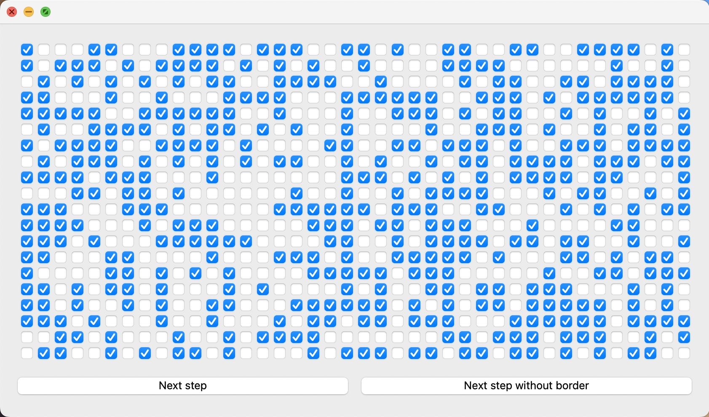

# gameOfLife

Back in 2016 i didn't know how to use github,
so I've made a repository and didn't upload anything.
Six years after i decided to rebuild it again and publish it, haha ;)

#### Qt C++

Conway's game of life made using QCheckboxes and two QButtons.

In main.cpp file you can adjust the amount of checkboxes

